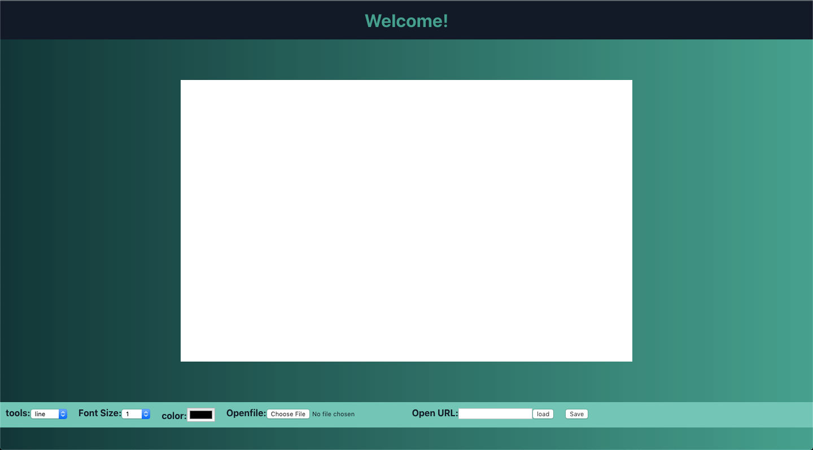

# Drawing-board
This is an interactive board where you can draw.🖋🖌

## Table of contents

- [General info](#general-info)
- [Screenshots](#screenshots)
- [Technologies](#technologies)
- [Contact](#contact)

## General info
This is an interactive board where you can draw. It has several tools and settings.📝🖋🖌

## Screenshots

## Technologies

- Html
- Css
- Javascript
- ReactJS

## view project

[Drawing Board](https://jhosep98.github.io/jdbsPaint-con-Reactjs/)

## Contact

Created by [@jhosep98](https://jhosep98.github.io/Portfolio2020jdb/) - feel free to contact me!
